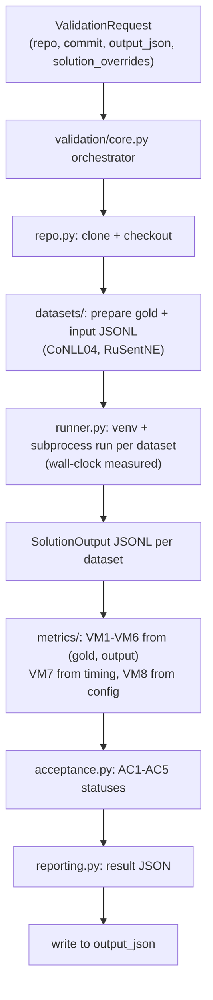

## M1 CLI implementation

### 1. Executive summary

#### 1.1 Spec description 

This spec implements M1 of the validation spec: the complete validation procedure of `entity-processing` solutions accessible via CLI. The implementation delivers `validation_cli.py` — a Hydra app that, given `repo`, `commit`, `output_json` and `solution_overrides`, clones the solution repo, prepares the CoNLL04 and RuSentNE gold datasets, runs the solution's `scripts/extract_entities.py` in an isolated venv per dataset, computes metrics VM1–VM8, evaluates acceptance criteria AC1–AC5, and writes the result JSON in the format defined by the validation spec §4.1.

#### 1.2 Spec motivation

The validation spec defines what must be validated but nothing exists yet — this is the first implementation spec of the validation subproject. The CLI path carries all the substance (datasets, runner, metrics, acceptance); M2's HTTP service is a thin wrapper over it.

#### 1.3 Implementation repos

`entity-processing-validation`

### 2. Requirement analysis

#### 2.1 Functional requirements

**FR1. Repository scaffold.** Set up the hydra-backed repo structure: `pyproject.toml`, `requirements.txt`, `requirements_dev.txt`, `run_linters.sh`, `config/` with Hydra base configs (per validation spec §4.2 layout), `validation/` package, `tests/`.

**FR2. Dataset preparation.** Fetch CoNLL04 (raw converted JSON from the spert dataset storage host — the URL-based equivalent of the spert repo's `scripts/fetch_datasets.sh`, which requires a full repo clone; not executed) and RuSentNE (labelled TSV from the dialogue-evaluation GitHub repo), convert both to gold JSONL: CoNLL04 → gold entities + relations; RuSentNE → gold entities with sentiment labels (per the upstream label encoding: 0 = neutral, -1 = negative, 1 = positive), with common-noun mentions filtered out per validation spec §3.2 (filtering is tag-based, by the dataset's `entity_tag` column, with a bare-token fallback). Produce solution input files (`{"doc_id", "text"}` records) from each dataset's texts, with duplicate sentence texts deduplicated into single documents. Per-dataset fetch URLs and `max_docs` are Hydra-configurable (`config/datasets` node, keys `datasets.<name>.source_repo`/`fetch_script`/`max_docs`); the fetchers use direct URLs derived from the dataset source repositories, and `source_repo`/`fetch_script` keys are retained only as provenance metadata (the spert shell script is not executed). **Raw dataset downloads are cached**: fetched raw files are stored in a shared cache directory (default `~/.cache/entity_processing_validation/datasets`, overridable via the `datasets_cache_dir` Hydra config key) and reused across validation runs; a download is skipped when the cached file already exists and is non-empty. Conversion to gold/input JSONL remains per-run (cheap, CPU-only).

**FR3. Solution runner.** Given a cloned solution repo at a commit: create an isolated venv in the run's working directory, install the solution's dependencies from its `requirements.txt`/`pyproject.toml`, run `scripts/extract_entities.py` once per dataset with hydra-style `input=`, `output=` and the three type-list arguments plus `solution_overrides` (constitution spec §3 contract), with configured timeout, cwd = clone, captured stdout/stderr; measure wall-clock time per run. Delete the venv afterwards.

**FR4. Metrics.** Compute VM1–VM6 from (gold dataset, solution output) pairs per validation spec §2 definitions (exact mention/type matching, sentiment conditional on entity match, relation triple match); VM7 as the maximum over per-dataset speed values (wall-clock / (docs/100) per dataset run); VM8 by resolving the solution's effective Hydra config (static config + invocation args, e.g. `--cfg job`) and reading the model field.

**FR5. Acceptance evaluation.** Evaluate AC1–AC5 from metric values and thresholds; assemble the result JSON per validation spec §4.1 schema, including computation/acceptance statuses and error messages.

**FR6. CLI entrypoint.** `scripts/validation_cli.py` as a Hydra app: `repo=`, `commit=`, `output_json=`, `solution_overrides="..."`; orchestrates FR2–FR5 end-to-end and writes the result JSON to `output_json`. Any stage failure (clone, fetch, non-zero exit, unparseable output, timeout) degrades affected metrics to `failed_to_compute` with the error propagated, per validation spec §4.1 failure handling. The solution output schema is strict: records with fields outside the §3 contract make the output unparseable. Stale run artifacts (`*_input.jsonl`, `*_gold.jsonl`, `*_solution_output.jsonl`, `*_solution_venv/`) are swept from the workdir at run start, so runs in a persistent workdir cannot read a previous run's output.

#### 2.2 Non-functional requirements

**NFR1. Type safety.** All code uses Python type hints, enforced by linters (`run_linters.sh`); inter-stage data are Pydantic models.

**NFR2. Isolation.** Each validation run is fully self-contained in its configured working directory (clone, venv, datasets, output); runs share no state — with the single exception of the read-only raw dataset cache (FR2), which is safe to share across runs.

**NFR3. Testability.** Metrics and acceptance logic are covered by unit tests with fixture-sized gold/solution outputs; dataset conversion by tests on bundled mini-fixtures (no network in tests).

### 3. Acceptance criteria

This spec is validated by tests (manual execution mode, no validation subproject for the validation subproject itself). An implementation satisfies the spec when:

**AC1. Linting and typing pass.** `run_linters.sh` passes on the whole repo (type hints enforced per NFR1).

**AC2. Unit tests pass.** All tests under `tests/` pass: metrics (VM1–VM6 exact-match logic, VM7 arithmetic, VM8 config resolution on a fixture repo), acceptance status assembly (accepted/valid/invalid per validation spec §4.1), dataset conversion on bundled mini-fixtures (FR2), and failure-degradation paths (FR6: non-zero exit, unparseable output, timeout → `failed_to_compute` with error message).

### 4. Insight

The validation spec §4 already fixes the approach (modular hydra-backed pipeline, FastAPI+uvicorn for M2, venv sandbox), so no alternative large-scale ideas are explored here.

### 5. Overall solution design

#### 5.1 High-level design

The orchestrator `validation/core.py` chains the stages sequentially per validation run and owns the failure-handling policy: an exception in any stage marks the affected metrics `failed_to_compute` (with the error message) instead of aborting the whole run, so the result JSON is always produced.

#### 5.2 Core components

Mirrors the validation spec §4.2 layout:

1. **`validation/base.py`** — Pydantic models: `ValidationRequest`, `GoldDataset`, `SolutionOutput`, `TimingInfo`, `MetricResult`, `ACResult`, `ValidationResult`.
2. **`validation/repo.py`** — clone the solution repo, checkout the given commit; return the clone path.
3. **`validation/datasets/`** — `conll04.py` (fetch via spert `scripts/fetch_datasets.sh`, convert to gold entities + relations), `rusentne.py` (fetch, convert to gold entities with sentiments, filter common nouns); each produces a `GoldDataset` plus a solution input JSONL file.
4. **`validation/runner.py`** — per dataset: create venv in the run workdir, install solution deps, `subprocess.run` `scripts/extract_entities.py` with the §3 contract args and `solution_overrides`, configured timeout, captured output; measure wall-clock; delete venv. Returns `SolutionOutput` paths + `TimingInfo`.
5. **`validation/metrics/`** — `entity.py` (VM1, VM2), `sentiment.py` (VM3, VM4), `relation.py` (VM5, VM6), `llm_check.py` (VM8, resolves the solution's effective Hydra config from the clone); `base.py` defines the metric interface over `(GoldDataset, SolutionOutput)`.
6. **`validation/acceptance.py`** — AC1–AC5 thresholds → per-metric acceptance status, per-AC status (`accepted`/`valid`/`invalid`).
7. **`validation/reporting.py`** — assemble the validation spec §4.1 result JSON from `ValidationResult`.
8. **`scripts/validation_cli.py`** — Hydra app; parses `repo`, `commit`, `output_json`, `solution_overrides`; delegates to `core.py`.

### 6. Implementation plan

#### 6.1 Todo list

1. **Scaffold (FR1)**: create `pyproject.toml`, `requirements.txt`, `requirements_dev.txt`, `run_linters.sh`, `config/config.yaml` (port, workdir, timeouts, dataset paths), `config/datasets/{conll04,rusentne}.yaml`, `validation/` package skeleton, `tests/`; verify linters run.
2. **Models (§5.2.1)**: implement `validation/base.py` Pydantic models; unit-test round-trip of the result JSON schema.
3. **Repo prep (§5.2.2)**: implement `validation/repo.py` (clone + checkout); test with a local tmpdir git fixture.
4. **Dataset preparation (FR2)**: implement `validation/datasets/conll04.py` and `rusentne.py`; test conversion on bundled mini-fixtures of each raw format (no network).
5. **Runner (FR3)**: implement `validation/runner.py` (venv creation, dependency install, subprocess execution, timing, venv cleanup); test with a stub script in a tmpdir repo.
6. **Metrics (FR4)**: implement `metrics/entity.py`, `metrics/sentiment.py`, `metrics/relation.py`, `metrics/llm_check.py`; unit-test each VM against hand-computed fixture cases; test VM8 config resolution on a fixture repo with Hydra configs.
7. **Acceptance + reporting (FR5)**: implement `validation/acceptance.py` and `reporting.py`; unit-test status logic (accepted/valid/invalid) against the validation spec §4.1 rules.
8. **CLI (FR6)**: implement `scripts/validation_cli.py` + `validation/core.py` orchestration with failure degradation; integration-test the CLI on a stub solution + stub dataset configs.
9. **Finalize**: run linters on the whole repo, run the full test suite, update README.

#### 6.2 Modification summary

| File | Action |
|------|--------|
| `pyproject.toml` | New |
| `requirements.txt` | New |
| `requirements_dev.txt` | New |
| `run_linters.sh` | New |
| `config/config.yaml` | New |
| `config/datasets/conll04.yaml` | New |
| `config/datasets/rusentne.yaml` | New |
| `validation/__init__.py` | New |
| `validation/base.py` | New |
| `validation/core.py` | New |
| `validation/repo.py` | New |
| `validation/datasets/__init__.py` | New |
| `validation/datasets/base.py` | New |
| `validation/datasets/conll04.py` | New |
| `validation/datasets/rusentne.py` | New |
| `validation/runner.py` | New |
| `validation/metrics/__init__.py` | New |
| `validation/metrics/base.py` | New |
| `validation/metrics/entity.py` | New |
| `validation/metrics/sentiment.py` | New |
| `validation/metrics/relation.py` | New |
| `validation/metrics/llm_check.py` | New |
| `validation/acceptance.py` | New |
| `validation/reporting.py` | New |
| `scripts/validation_cli.py` | New |
| `tests/` (unit + integration tests, fixtures) | New |
