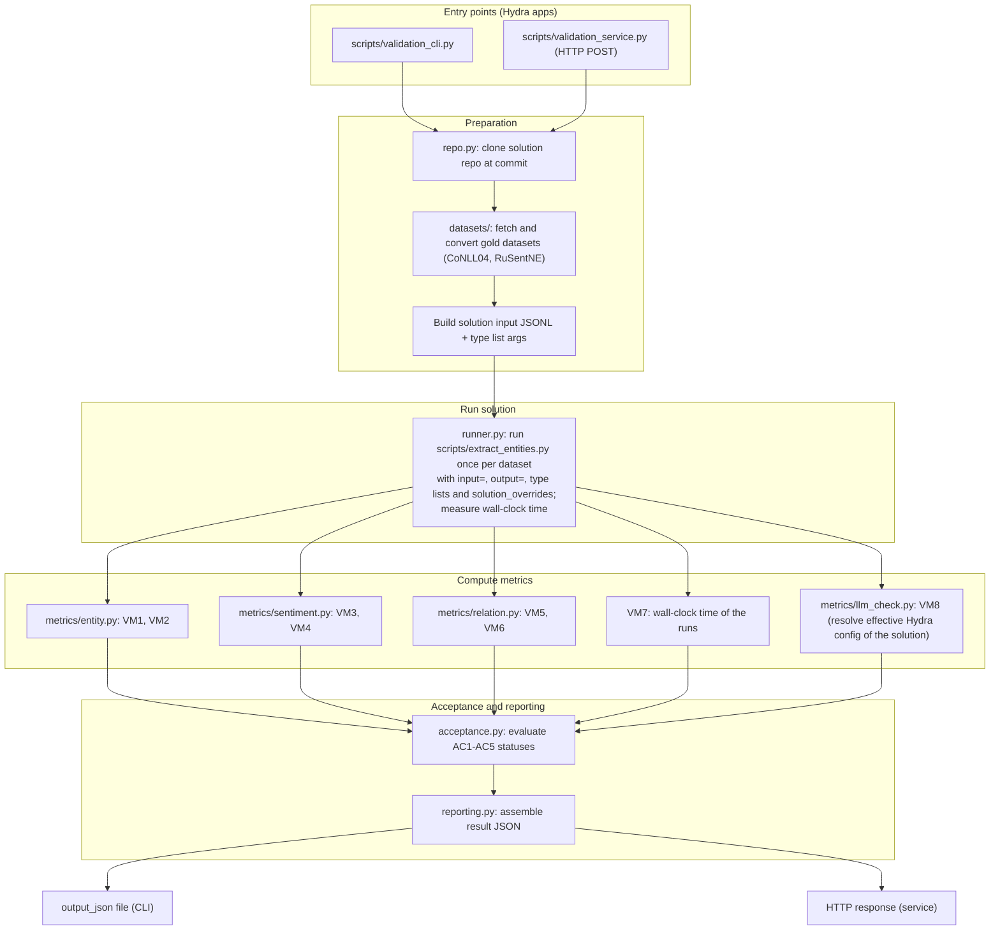
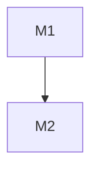

## entity-processing validation spec

### 1. Repo structure

#### 1.1 Solution subproject management repo

`entity-processing`

#### 1.3 Validation subproject implementation repos

`entity-processing-validation`

### 2. Validation metrics

**VM1. Entity precision.** Over all entities produced by the solution (on the datasets of §3.1/§3.2), the fraction whose (mention, type) pair matches a gold entity of the same dataset by exact string match of the mention and equality of the type. Returns a value from 0 to 1.

**VM2. Entity recall.** Over all gold entities of the evaluated dataset, the fraction matched by a produced entity with the same (mention, type). Returns a value from 0 to 1.

**VM3. Sentiment precision.** Over all produced entities carrying a sentiment label, the fraction whose sentiment equals the gold sentiment of the matching gold entity (matching per VM1/VM2). Returns a value from 0 to 1.

**VM4. Sentiment recall.** Over all gold entities carrying a gold sentiment label, the fraction whose gold sentiment equals the sentiment of a matching produced entity. Returns a value from 0 to 1.

**VM5. Relation precision.** Over all relations produced by the solution, the fraction whose (relation_type, head mention, tail mention) matches a gold relation by exact string match of both mentions and equality of the relation type. Returns a value from 0 to 1.

**VM6. Relation recall.** Over all gold relations of the evaluated dataset, the fraction matched by a produced relation with the same (relation_type, head mention, tail mention). Returns a value from 0 to 1.

**VM7. Time per 100 docs.** Wall-clock time of the solution run (in minutes) divided by the number of input documents divided by 100.

**VM8. LLM model check.** True iff the solution's Hydra configuration as invoked by the validation service (the config inspected in the cloned repo at the specified commit) resolves to the model `glm-5.3-flash`; False otherwise.

| FR/NFR | VMs |
|--------|-----|
| FR1 | VM1, VM2 |
| FR2 | VM3, VM4 |
| FR3 | VM5, VM6 |
| NFR1 | VM7 |
| NFR2 | VM8 |

### 3. Acceptance criteria

**AC1. Accurate Entity Extraction**: VM1 > 0.8 and VM2 > 0.8

**AC2. Accurate Sentiment Analysis**: VM3 > 0.8 and VM4 > 0.8

**AC3. Accurate Relation Extraction**: VM5 > 0.6 and VM6 > 0.6

**AC4. Satisfactory Time Performance**: VM7 < 10 minutes

**AC5. Correct LLM model**: VM8 = True

| FR/NFR | ACs |
|--------|-----|
| FR1 | AC1 |
| FR2 | AC2 |
| FR3 | AC3 |
| NFR1 | AC4 |
| NFR2 | AC5 |

The validation metrics will be computed on two datasets: an open-source dataset **CoNLL04** (entities and their relations) and an open-source dataset **RuSentNE** (sentiment analysis).

#### 3.1. CoNLL04

Source: https://github.com/lavis-nlp/spert/tree/master (`scripts/fetch_datasets.sh`)

Results are inspected for:
  - Entity precision and recall (VM1, VM2)
  - Relation precision and recall (VM5, VM6)

**Note:** classical dataset for NER + relations is TACRED (and its derivatives) but it is under the fee wall. Another large-scale dataset is FewRel (and its derivatives), it is freely available. However, it is too diverse (it is featured by a huge number of relations which has to be grouped for our purposes). This justifies why we selected CoNLL04.

#### 3.2. RuSentNE

Source: https://github.com/dialogue-evaluation/RuSentNE-evaluation

Results are inspected for:
  - Sentiment precision and recall (VM3, VM4)

Gold entity mentions are taken from the dataset's own entity list; mentions that are common nouns rather than named entities are filtered out from the gold set before metric computation.

**Note:** this is a dataset with Russian news. Strictly speaking, many entities there are just nouns rather than named entities but it is feasible to filter them out.

### 4. Overall validation service design

#### 4.1 High-level design

The validation service is a hydra-backed repository following the same repo rules as the solution subproject: executable Hydra entrypoints in `scripts/`, all parameters configurable via Hydra YAML configs in `config/` (no hardcoded values), type-hinted code enforced by linters.

Any validation run proceeds through the following stages:



Both entry points provide the same validation procedure:
1. CLI
  - There should be an executable script `validation_cli.py` which a user/agent would run via `python validation_cli.py repo=<clonable link to repo> commit=<commit hash> output_json=<path to output json> solution_overrides="<args separated by whitespaces>"` where `repo` and `commit` point at the solution implementation to validate, `output_json` points at the output file where the acceptance results will be saved to (see the json format in the "HTTP service" part) and `solution_overrides` points at the arguments to be used to run the solution.
2. HTTP service
  - There should be an executable script `validation_service.py` which a user would run via `python validation_service.py port=<port>` expecting that it will listen to the specified port and accept HTTP POST requests with a json payload `{"repo": "<clonable link to repo>", "commit": "<commit hash>", "solution_overrides": "<args separated by whitespaces>"}`. The expected answer is a json 
```
{
  "AC1": {
    "status": "<accepted, valid or invalid>",
    "metrics_status": {
      "VM1": {
        "computation_status": "<computed or failed_to_compute>",
        "acceptance_status": "<accepted or rejected>",
        "computed_value": <computed metric value if computation_status == computed and null otherwise>,
        "expected_value_or_threshold": "<expected value or threshold based on the acceptance criterion condition>",
        "error_message": "<null if computation_status == computed and the actual error message otherwise>"
      },
      "VM2": ...,
      "VM3": ...
    }
  },
  "AC2": ...,
  "AC3": ...
}
```
Here is an explanation of the acceptance criterion status:
- status "accepted" means that all the criterion metrics have acceptance_status "accepted" 
- status "valid" means that all the criterion metrics have computation_status "computed" and at least one has acceptance_status "rejected"
- status "invalid" means that at least one criterion metric has computation_status "failed_to_compute"

Behavioral rules:

- **Hydra configuration**: both entrypoints are Hydra apps. All service parameters (port, working directory, dataset configs, fetch behavior, timeouts) are configurable via Hydra YAML configs under `config/`; credentials and endpoints, if needed, go to `config/user_settings/`.
- **Two runs, one per dataset**: the runner executes `scripts/extract_entities.py` once per dataset against the same clone of the solution repo (per the invocation contract in the constitution spec §3: hydra-style `input=`, `output=` and the three type-list arguments). VM7 is computed from the combined wall-clock time over both runs.
- **VM8**: the runner resolves the effective Hydra configuration of the solution (static config composed with the invocation arguments, including `solution_overrides`), e.g. via the solution's own config composition (`--cfg job` or equivalent), and reads the model field.
- **Failure handling**: if the solution script exits with a non-zero code, produces unparseable output, or dataset preparation fails, all affected metrics get computation_status `failed_to_compute` (making the corresponding criteria `invalid`), with the error message propagated to `error_message`.
- **Run directory**: each validation run works in a self-contained working directory (clone, datasets, solution output, intermediate artifacts) configured via Hydra, so runs are reproducible and parallelizable.

#### 4.2 Core components

Repository layout (python modules):

```
entity-processing-validation/
├── pyproject.toml
├── requirements.txt
├── requirements_dev.txt
├── run_linters.sh
├── config/
│   ├── config.yaml                # defaults: port, workdir, dataset paths, timeouts
│   ├── datasets/conll04.yaml      # source, fetch script args, gold conversion params
│   ├── datasets/rusentne.yaml
│   └── user_settings/             # credentials/endpoints if needed (gitignored)
├── validation/
│   ├── __init__.py
│   ├── base.py                    # Pydantic models: ValidationRequest, GoldDataset, SolutionOutput, MetricResult, ACResult, ValidationResult
│   ├── core.py                    # orchestrator: request -> repo prep -> dataset prep -> run -> metrics -> acceptance -> result
│   ├── repo.py                    # clone/checkout of the solution repo at the given commit
│   ├── datasets/
│   │   ├── base.py                # dataset preparation interface
│   │   ├── conll04.py             # fetch via spert scripts + convert to gold JSONL
│   │   └── rusentne.py            # fetch + convert to gold JSONL (entity filter included)
│   ├── runner.py                  # run scripts/extract_entities.py in the cloned repo; measure wall-clock
│   ├── metrics/
│   │   ├── base.py                # metric interface over (gold dataset, solution output)
│   │   ├── entity.py              # VM1, VM2
│   │   ├── sentiment.py           # VM3, VM4
│   │   ├── relation.py            # VM5, VM6
│   │   └── llm_check.py           # VM8
│   ├── acceptance.py              # AC1-AC5: metric values + thresholds -> statuses
│   └── reporting.py               # assemble the result JSON (schema above)
├── scripts/
│   ├── validation_cli.py          # Hydra entrypoint (CLI mode)
│   └── validation_service.py      # Hydra entrypoint (HTTP mode)
└── tests/
```

Notes on conventions:

- **Types**: request/response and inter-stage data are Pydantic models defined in `validation/base.py`; no plain dicts or lists cross component boundaries.
- **Component interface**: pipeline stages are `Function[InputT, OutputT]` subclasses (per the mourat architectural invariant), keeping stages independently usable and composable; metric functions in `metrics/` map to VMs (grouped one module per requirement).
- **Independence**: each validation run is self-contained in its configured working directory; no state is shared between runs except through explicit config.

Implementation details of key components:

- **`scripts/validation_service.py`** — HTTP host. Implemented with **FastAPI + uvicorn**: the script is a Hydra app whose `port` override is passed to `uvicorn.run(app, host="localhost", port=...)`; the app exposes a single `POST /validate` endpoint that accepts the json payload, converts it to `ValidationRequest`, runs the same orchestrator (`validation/core.py`) as the CLI, and returns the result JSON. Validation runs triggered by HTTP requests are executed synchronously per request (one request = one full validation run); no job queue or background workers unless a KISS spec adds them later.
- **`validation/runner.py`** — sandboxed execution of the solution script.
  - **Environment**: each validation run creates an isolated **venv** in the run's working directory, installs the solution repo's dependencies from its `requirements.txt`/`pyproject.toml` into it (the venv is created with the system Python, packages installed via pip from the solution's own dependency declarations), and runs `scripts/extract_entities.py` with that venv's interpreter. This guarantees the solution's dependencies never leak into the validation service's environment and different solution commits are isolated from each other. The venv is temporary and is deleted after the validation run.
  - **Execution**: the script is launched as a subprocess (`subprocess.run`) with: cwd = the cloned solution repo, env = the venv's environment, timeout from the Hydra config (a hard upper bound well above the NFR1 threshold so that a hanging solution fails with `failed_to_compute` rather than blocking the service), and stdout/stderr captured for the `error_message` on failure. No network isolation or containerization is assumed at this stage — the solution legitimately needs network access to call the LLM API; confinement (e.g. Docker) is out of scope unless a future spec requires it.

### 5. Roadmap

The implementation is organized as two milestones. M1 delivers the full validation procedure behind the CLI; M2 adds the HTTP service on top of the already working pipeline.

| ID | Name | Status | Expected result | Duration | Strong scaling efficiency |
|----|------|--------|-----------------|----------|---------------------------|
| M1 | CLI implementation | To do | Repository scaffold (`pyproject.toml`, `requirements*.txt`, `run_linters.sh`, Hydra `config/`). Dataset preparation for CoNLL04 and RuSentNE (fetch + gold JSONL conversion). Solution runner (venv sandbox, subprocess execution, timing). Metrics VM1–VM8 and acceptance criteria AC1–AC5 evaluation. `scripts/validation_cli.py` validating a solution repo end-to-end from the command line, producing the result JSON. | 2 | 0.5 |
| M2 | HTTP service implementation | To do | `scripts/validation_service.py` exposing the same validation procedure via HTTP (FastAPI + uvicorn, `POST /validate`), reusing the M1 orchestrator unchanged. | 0.5 | 0.8 |


